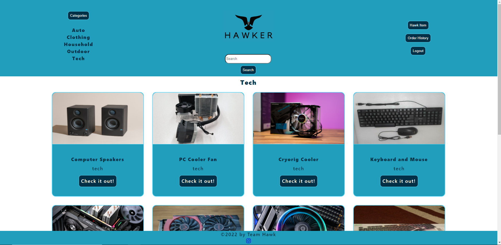

# Hawker

## Table of Contents
  - [Description](#description)
  - [Created With](#created-with)
  - [Usage Instructions](#usage)
  - [Badges](#badges)
  - [License Section](#license)
  - [Contact Us](#contact-us)
## Description
Do you have a spectacular item that you just don't need anymore? Are you in search of something specific but don't want to spend an inordinate amount of money or search every thrift store in the greater metropolitan area? Come check out Hawker!
## Created With:
React, Sass, GraphQL, HTML, JavaScript, Faker.js, dotenv, bcrypt, Faker.js, Jest, React Router, JWT, Stripe, YAML, Webpack
## Usage
Check out our site at [Hawker](https://texas-hawker.herokuapp.com/) and hawk your wares! The finished output:

## Badges

## License
Permission to use this application is granted under the MIT license.
Click on the link for more information: [MIT License Information](https://opensource.org/licenses/MIT)
### Contact Us
*Made with a whole lot of :heart: by:*
Nicholas Nolen [(@nicnolen)](https://github.com/nicnolen), Craig Jensen [(@CraigMJensen)](https://github.com/CraigMJensen), Jide Ogunbanjo [(@JideOgun)](https://github.com/JideOgun), Nigel Loch [(@nigelloch)](https://github.com/nigelloch), Samantha Chavez [(@Sammychvz17)](https://github.com/Sammychvz17), Sarah Wylie [(@sarahwylie)](https://github.com/sarahwylie)
© 2022
